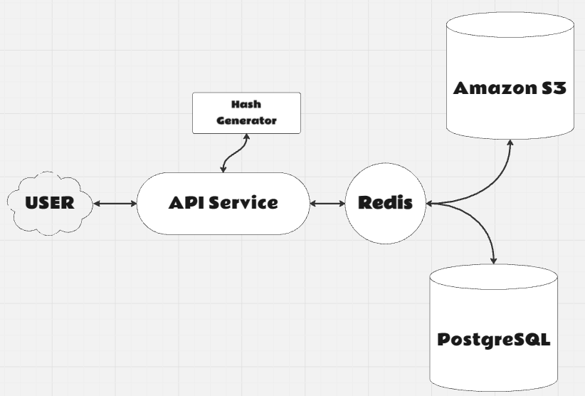

# Pastebin Project 📝


A Django-based Pastebin-like service that allows users to create, retrieve, and manage text blocks with expiration times and optional password protection. This project is containerized using Docker for easy setup and scaling. Celery is integrated for background task processing, including the deletion of expired text blocks.

---

## Features ✨

- **Create and retrieve text blocks**: Users can create text blocks with a custom expiration time.
- **Password protection**: Optional password protection to restrict access to text blocks.
- **Expiration handling**: Text blocks automatically expire after a defined time and are periodically deleted.
- **Popular text caching**: Frequently accessed text blocks are cached using Redis to improve performance.
- **S3 Integration**: Text block content is stored in an AWS S3 bucket.
- **Celery task processing**: Background tasks for periodic cleanup of expired links using Celery.
- **PostgreSQL support**: PostgreSQL is used as the default database in the containerized environment.
- **Redis for caching**: Integrated Redis for popular text caching and as a broker for Celery tasks.

---
# Technologies Used 🛠️

- **Django**: Core framework
- **Django REST Framework**: For building APIs
- **Celery**: Task queue for background jobs
- **Redis**: In-memory data structure store, used for caching and Celery's message broker
- **PostgreSQL**: Database for storing metadata and text blocks
- **AWS S3**: For storing text content in the cloud
- **Docker**: Containerization
- **Poetry**: Dependency management
---
## Prerequisites 📋

To run this project locally, you will need:

- [Docker](https://www.docker.com/get-started)
- [Docker Compose](https://docs.docker.com/compose/install/)
- AWS account for S3 bucket storage
- Redis

---

# Environment Variables 🌍

The project is configured to use .env file for environment-specific variables. You can configure the following in your .env file:

```
# Django settings
SECRET_KEY=your_secret_key_here
DEBUG=True
DJANGO_ALLOWED_HOSTS=localhost 127.0.0.1 [::1]

# AWS settings
AWS_ACCESS_KEY_ID=your_aws_access_key
AWS_SECRET_ACCESS_KEY=your_aws_secret_key
AWS_STORAGE_BUCKET_NAME=your_s3_bucket_name
AWS_S3_REGION_NAME=your_s3_region_name

# Redis settings
REDIS_URL=redis://localhost:6379/3

# PostgreSQL settings
POSTGRES_DB=pastebin_db
POSTGRES_USER=pastebin_user
POSTGRES_PASSWORD=your_password_here
POSTGRES_HOST=db
POSTGRES_PORT=5432

```

# Setup & Installation ⚙️
1. Clone the repository:
```
git clone https://github.com/VladPrime11/pastebin.git
cd pastebin
```
2. Create a ```.env``` file based on the example above.
3. Run the Docker setup:
```
docker-compose up --build
```
4. Access the web service:
Open your browser and go to ```http://localhost:8000```

# API Endpoints 🌐

### 1. **POST /texts/create/**

- **Description**: Create a new text block with optional password protection and expiration time.

#### **Request Body**:

```json
{
    "content": "Your text here",
    "expires_in": 3600,
    "password": "optional_password"
}
```
#### **Responce**:
```json
{
    "url": "http://localhost:8000/texts/<uuid>/"
}
```
The ```url``` in the response can be used to retrieve the text block later.
### 2. **GET /texts/<uuid>/**
- **Description**: Retrieve a text block by its unique uuid. If the block is password-protected, a password must be provided in the query parameters.
#### **Request Parameters**: 
- **uuid**: Unique identifier for the text block.
- **password** (optional): Password query parameter if the text block is protected.

**Example URL:**
```
GET http://localhost:8000/texts/<uuid>/?password=optional_password
```
#### **Responce**:
```json
{
    "content": "Your text here",
    "views": 5,
    "created_at": "2024-09-24T10:57:40.049997+00:00"
}
```
If the text block is password-protected, an incorrect or missing password will result in an error response:
#### **Password Required Response (400):**:
```json
{
    "error": "Password required to access this text block."
}
```
#### **Incorrect Password Response (403):**:
```json
{
    "error": "Incorrect password."
}
```
#### **404 Response (if the text block doesn't exist or has expired):**:
```json
{
    "error": "Text block not found."
}
```
# Background Tasks ⏳

### Celery Task

The project uses **Celery** to delete expired text blocks in the background. This task is scheduled to run every 10 minutes, checking and removing expired links.

- The task `delete_expired_links` is triggered periodically by **Celery Beat** to ensure that text blocks which have reached their expiration time are removed automatically.
- The Celery worker processes the task asynchronously, ensuring that the main application remains responsive even while background tasks are handled.

This setup improves performance by offloading time-consuming tasks like expiration checks to the background.

